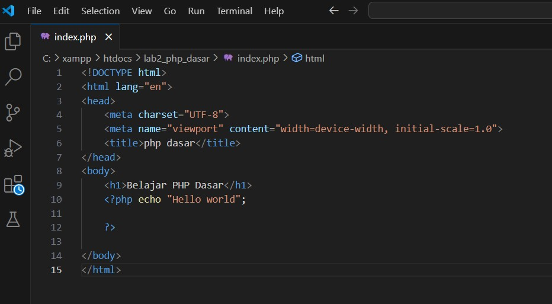
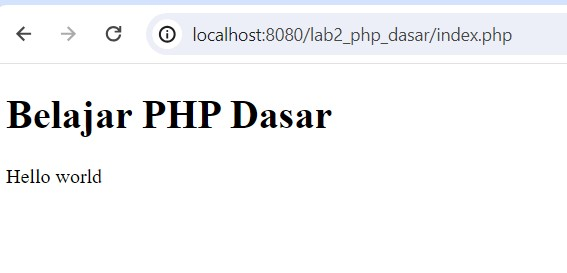

Nama : Abdul Gofar 
NIM : 312210504 
Kelas : TI.22.B2 

# Belajar PHP dasar

Repositori ini berisi contoh-contoh sederhana untuk belajar dasar-dasar pemrograman PHP. Terdapat dua file utama:  

1. `latihan.php`: File ini berisi latihan-latihan sederhana menggunakan PHP, seperti penggunaan variabel, form input, operator, kondisi, dan perulangan. 
2. `tugas.php`: File ini merupakan tugas sederhana yang meminta pengguna untuk memasukkan nama, tanggal lahir, dan pekerjaan, kemudian menampilkan output berupa umur berdasarkan tanggal lahir dan gaji berdasarkan pekerjaan yang dipilih. 

## Latihan PHP

Input  

Ouput  

